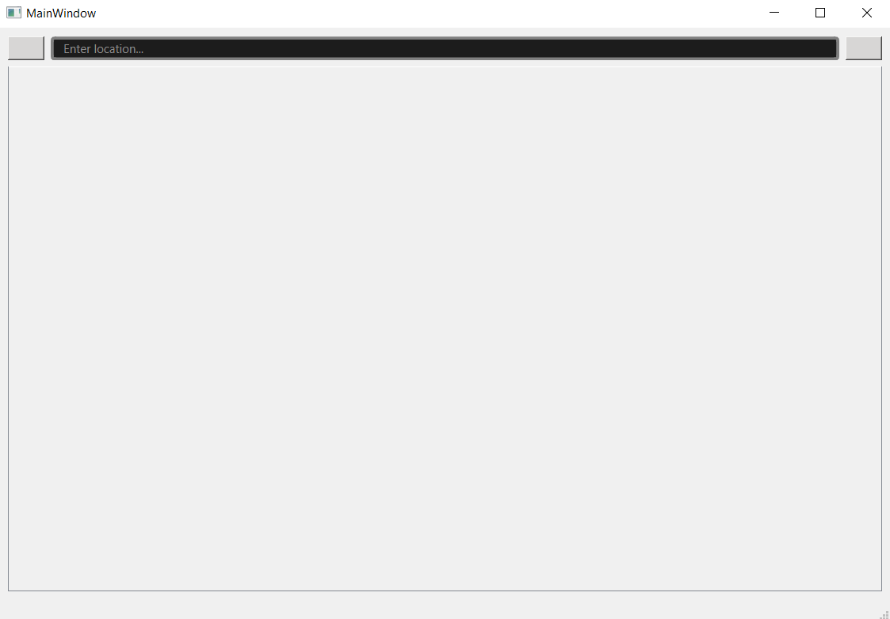

# Weather App - Software Verification Analysis (2026)

## Project Overview

This repository contains my analysis of the **Weather App** desktop application as part of the Software Verification course (MATF, University of Belgrade).

**Original project**  
Repository: https://gitlab.com/matf-bg-ac-rs/course-rs/projects-2023-2024/weather-app  

**Technologies**:
- C++20
- Qt 6.10.2 (MinGW 64-bit)
- CMake
- QNetworkAccessManager
- OpenCage Geocoding API (for city → coordinates conversion)
- OpenWeatherMap API (for weather data)

**Platform**: Windows 11

## Current Status

- Project builds successfully
- GUI launches correctly (MainWindow)
- User can type city name and see autocomplete suggestions (geocoding works via OpenCage API)
- Settings dialog opens and allows changing temperature, wind speed and precipitation units
- **Limitation**: The application requires a valid **OpenCage API key** for geocoding.  
  Without a valid key, the API returns "Host requires authentication" error (expected behavior).  
  → OpenCage API documentation: https://opencagedata.com/api

## Screenshots

### 1. Empty main window

### 2. Autocomplete suggestions when typing city name

### 3. Settings dialog and API authentication error in output

## Next steps in analysis

- Static code analysis (cppcheck, clang-tidy)
- Dynamic analysis (memory checking, sanitizers)
- Detailed architecture documentation (C4 diagrams, layered design)
- Code quality report, dependency analysis and identified limitations

---
**Last updated**: 08.02.2026